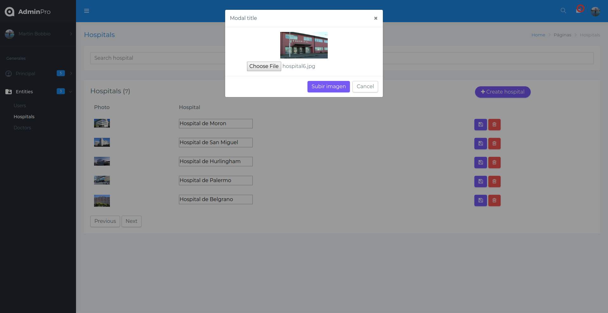
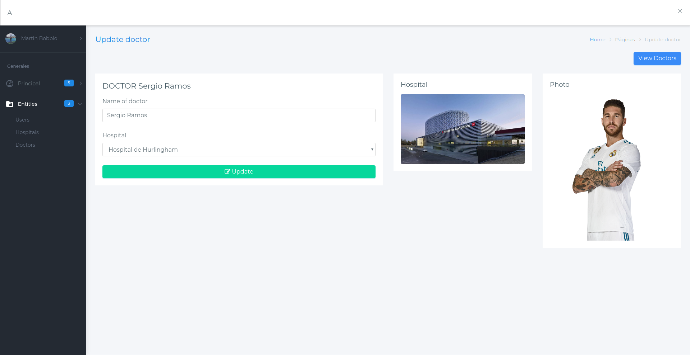
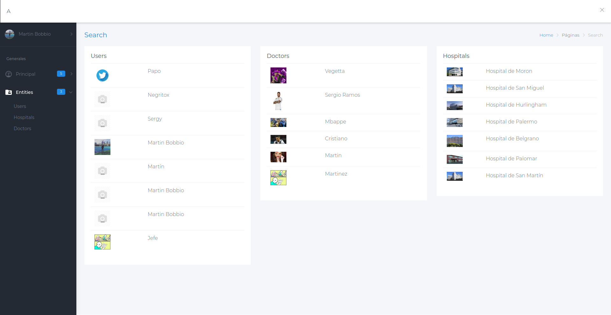
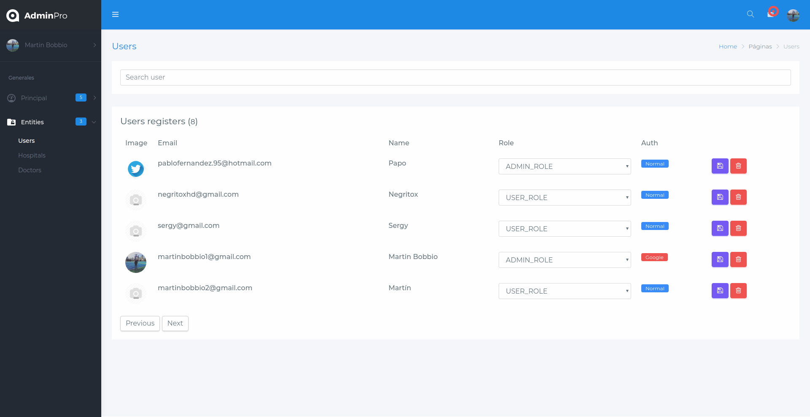
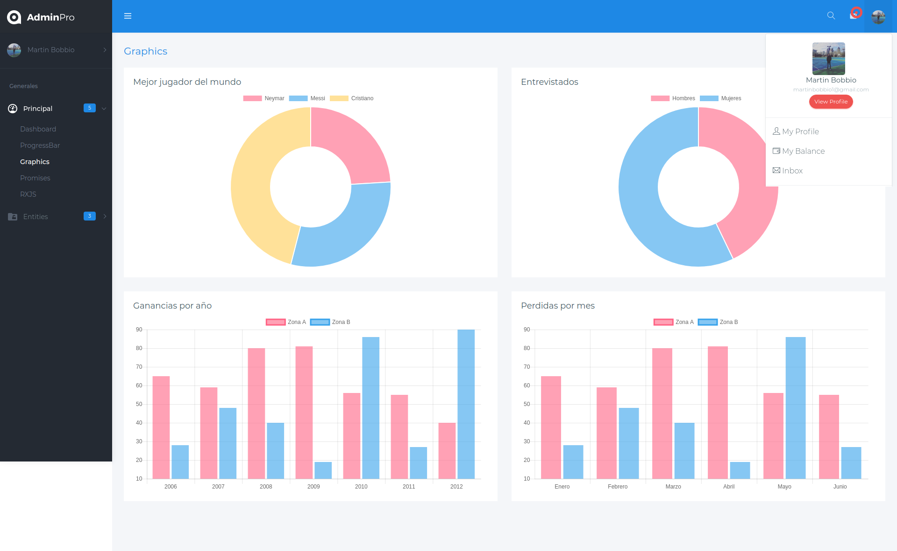

<h1 align="center">
   
  
   
  Adminpro - Frontend
   
</h1>
<h4 align="center"><a target="_blank" href="https://github.com/martinbobbio/backend-adminpro">Adminpro - Backend</a></h4>

## Descripción

Curso de desarrollo MEAN STACK de udemy. Resotorio de admin completo hecho en angular.
Administrador completo con entidades de usuarios, medicos, doctores. Auth normal y con Google.

## Capturas

# Login

